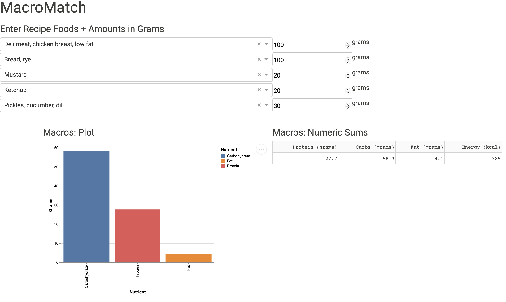

# MacroMatch

### [Try it here!](https://macromatch.onrender.com)

An extension of the [MacroView Shiny app](https://github.com/samson-bakos/MacroView), designed to visualize specific recipes. Built with Dash.

This app shares a user persona profile/ project background with its parent app, MacroView. Please find the original proposal for the MacroView App [here](https://github.com/samson-bakos/MacroView/blob/main/reports/proposal.md)

## Usage

The specific purpose of this app is to visualize the energy and macronutrient content of a recipe specified by the user. A snapshot of the layout is shown below, with the default input of a chicken breast sandwich with ketchup, mustard and pickle.

To get started, select five foods of choice from the dropdown menus -- enter text to narrow down your search. Food names and nutrient contents are drawn from ["Nutrient Value of Some Common Foods (NVSCF)" dataset](https://open.canada.ca/data/en/dataset/a289fd54-060c-4a96-9fcf-b1c6e706426f) published by Health Canada, discussed in the Dataset section below. Enter the desired weight in grams in each dropdown's corresponding text entry box (to the right)

`Important User Note`: to prevent errors during usage, all five dropdown/ numeric entry fields must be defined with valid inputs for the app to function properly. If a user wishes to use less than five items in a recipe, fill the remaining slots with any item, and set their weight to 0g. They will not be included in the computation in this case. MacroMatch does not currently support meals/recipes with greater than five ingredients.

The output widgets below show the total macro-nutrient and calorie contents of your selections. The plot to the left shows each major macronutrient (protein, carbs, fat) sorted in descending order. On the right, the table shows numeric values of each macronutrient, as well as total calories.

Experiment to compare the nutrient content of your favourite recipes/meals!

## About the Dataset

The dataset used is "The Canadian Nutrient File: Nutrient Value of Some Common Foods", published by Health Canada through the Open Government License, which is available through open.canada.ca and can be found [here](https://open.canada.ca/data/en/dataset/a289fd54-060c-4a96-9fcf-b1c6e706426f). 

The dataset lists the nutrient profile (19 different nutrient values) of a thousand of the most popular foods consumed in Canada. This app uses only a few columns from the dataset, specifically those pertaining to energy content, and the main three macronutrients (protein, carbs, fat). While macronutrients/ calories form the foundation of any nutrition plan, users are recommended to also be aware of the micronutrient content of the foods they consume to ensure they are eating a balanced, healthy diet. An easily readable .xml version of the dataset is available at the link above showing the entire dataset for all foods. A cleaned .csv (made by concatenating the csv files available through the open.canada portal) is also available into the 'data/' subdirectory of this repo

